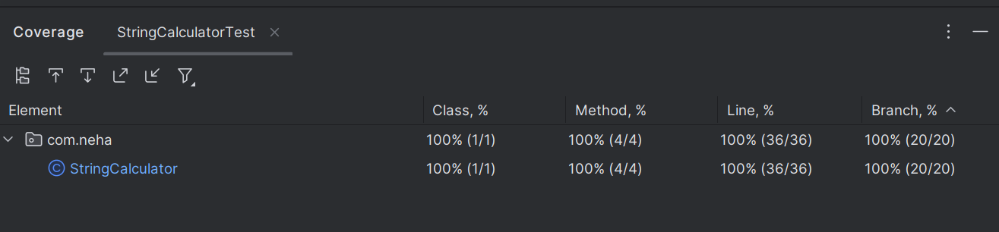

# String Calculator TDD Project

## Overview
The **String Calculator** is a Java-based application developed using Test-Driven Development (TDD). It processes a string of numbers separated by delimiters (e.g., commas, newlines, or custom delimiters) and returns their sum. The project follows strict TDD practices, where each feature is driven by failing tests, followed by code implementation to pass the tests, and subsequent refactoring to improve code quality.

### Features
- Handles empty strings (returns 0).
- Processes single numbers.
- Sums multiple numbers separated by commas or newlines.
- Supports custom single-character and multi-character delimiters (e.g., `//;\n1;2;3` or `//[***]\n1***2***3`).
- Supports multiple custom delimiters (e.g., `//[*][%]\n1*2%3`).
- Ignores numbers greater than 1000.
- Throws an exception for negative numbers with a descriptive message.
- Handles malformed inputs (e.g., invalid delimiter formats) by throwing exceptions.

### Test Cases 
| Description | Screenshots |
|-------------|-------------|
| [Added StringCalculator class and init JUnit scaffold] |  |
| [Step-1] Add and Pass test: empty string returns 0 |  |
| [Step-2] Add failing test: single number string should return the number |  |
| [Step-2] Pass test: single number returns its value from string to integer |  |
| [Step-3] Add failing test: comma separated two string should return the sum of that number |  |
| [Step-3] Pass test: comma separated two string should return the sum of that number |  |
| [Step-4] Add failing test: comma separated multiple number of string should return the sum of that number |  |
| [Step-4] Pass test: comma separated multiple number of string should return the sum of that number |  |
| [Step-5] Add passing test cases: multiple comma-separated numbers return correct sum |  |
| [Step-6] Add failing test: multiple comma-separated numbers with newline delimiter should return correct sum |  |
| [Step-6] Pass test: multiple comma-separated numbers with newline delimiter should return correct sum |  |
| [Step-7] Add failing test: multiple comma-separated numbers with any delimiter should return correct sum |  |
| [Step-7] Pass test: multiple comma-separated numbers with any delimiter should return correct sum |  |
| [Step-8] Add failing test: if in input there is a negative number in string need to throw exception |  |
| [Step-8] Pass test: if in input there is a negative number in string need to throw exception |  |
| Change in exception's message based on documentation |  |
| [Step-9] Add failing test: if in input there is a >1000 number is there then ignore it and return sum |  |
| [Step-9] Pass test: if in input there is a >1000 number is there then ignore it and return sum |  |
| [Step-10] Add failing test: any length delimiter in [] |  |
| [Step-10] Pass test: any length delimiter in [] |  |
| [Step-11] Pass test: any length of any number of delimiters in [] |  |
| [Step-12] Pass test: handle all branch and lines |  |

## Code Coverage
The project achieves **100% coverage**

